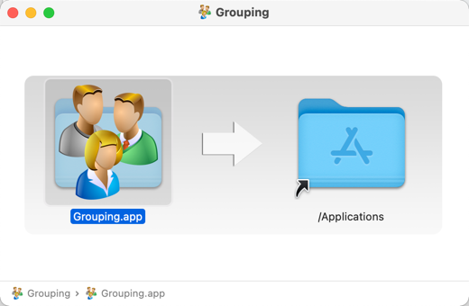

# Grouping SWEN1 V2022

Repository: 
[https://github.zhaw.ch/SWEN1-LP2019/SWEN1-Grouping-2022](https://github.zhaw.ch/SWEN1-LP2019/SWEN1-Grouping-2022)

### Installers

Installers for macOs or Windows can be found in the folder installers.

**macOs Installer**




<br/>

**Windows Installer**

### Required Java Version

JDK17 or OpenJDK17

### Run the project from the IDE

Open src/main/java ch.zhaw.grouping and start the Launcher

### Run the project from the command line

```sh
mvn clean compile javafx:run
```
For this modular projects, create and run a custom image:

```sh
mvn clean compile javafx:jlink

target/grouping/bin/java -m ch.zhaw.grouping/ch.zhaw.grouping.Launcher
```

### Build an installer

Cross compilation is not possible. Mac installer only on Mac, Windows installer only on windows.

For macOS:

```shell
mvn clean compile javafx:jlink -P macOs jpackage:jpackage
```

For Windows:

```shell
mvn clean compile javafx:jlink -P win jpackage:jpackage
```
