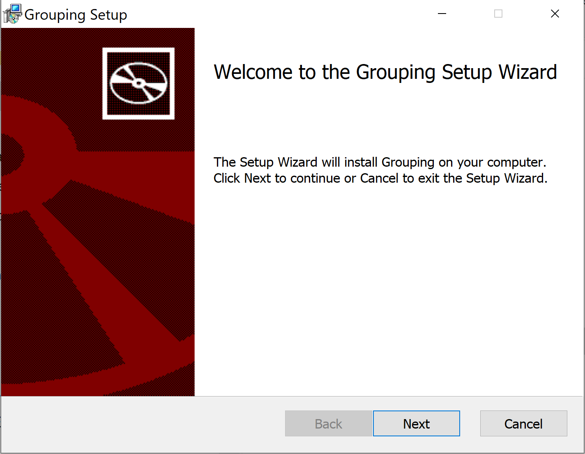

# Grouping SWEN1 V2022

Repository: 
[https://github.zhaw.ch/SWEN1-LP2019/SWEN1-Grouping-2022](https://github.zhaw.ch/SWEN1-LP2019/SWEN1-Grouping-2022)

### Installers

Installers for _macOs_ or _Windows_ can be found in the folder installers.
The installer provides a _JPMS-based_ Java runtime environment based on _JDK17_.
This means, the _Grouping App_ should run without a separate _JDK17_ installation.

The installation has been tested with macOS Big Sur (Intel) and Windows 10.

**macOs Installer**


<br/>

**Windows Installer**



<br/>

### Required Tools for development

- JDK17 or OpenJDK17
- Maven (the project contains the maven wrapper: Windows mvnw, macOs oder Linux ./mvnw)

### Run the project from the IDE

Open the folder _src/main/java_ and package _ch.zhaw.grouping_ and start the Launcher

### Run the project from the command line

```sh
mvn clean compile javafx:run
```
For this modular projects, create and run a custom image:

```sh
mvn clean compile javafx:jlink

target/grouping/bin/java -m ch.zhaw.grouping/ch.zhaw.grouping.Launcher
```

### Build an installer

Cross compilation is not possible. Mac installer only on Mac, Windows installer only on windows.
The new installer can be found in the _target/dist_ folder.

For macOS:

```shell
mvn clean compile javafx:jlink -P macOs jpackage:jpackage
```

For Windows:

```shell
mvn clean compile javafx:jlink -P win jpackage:jpackage
```
